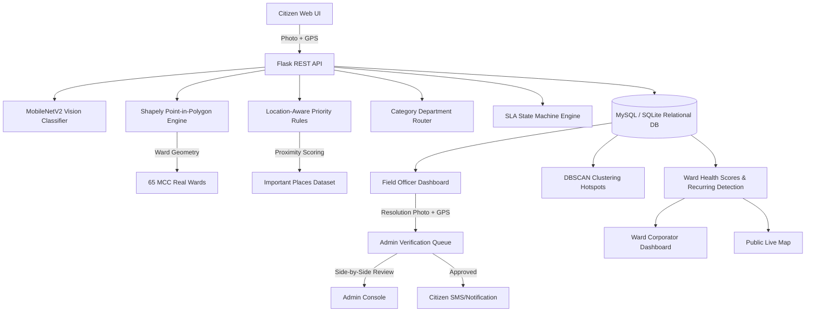

# Mysuru Civic Connect (MCC) — Architecture & Technical Design

## 1. High-Level Architecture Overview

Mysuru Civic Connect (MCC) is an AI-driven, GIS-integrated civic monitoring and resolution platform designed for **Mysuru City Corporation**.

---

## 2. Core Subsystems

### 2.1 GIS Ward Resolution Subsystem (`ward_lookup.py`)
- Sourced from authentic Mysuru Municipal spatial records (`2001_2011_Pop`).
- Contains all **65 municipal wards** of Mysuru City Corporation in standard WGS84 GeoJSON (`EPSG:4326`).
- Executes `Point(lng, lat).within(polygon)` checks to automatically map GPS coordinates to the authentic ward number and name.
- Explicit out-of-bounds protection: coordinates outside the municipal boundary trigger `outside_mcc_boundary: true` and are flagged for review rather than inaccurately guessed.

### 2.2 Computer Vision Subsystem (`ml/`)
- Transfer learning pipeline based on **MobileNetV2** pre-trained on ImageNet.
- 4-class classifier:
  1. Garbage / Waste
  2. Pothole / Road Damage
  3. Streetlight Failure
  4. Water Leakage
- Trained exclusively on real civic datasets acquired via the Kaggle API.
- Incorporates a confidence threshold (default 60%). Classifications below threshold are marked `LOW_CONFIDENCE` and routed to manual review.

### 2.3 Location-Aware Priority Engine (`priority_engine.py`)
Calculates priority through an explainable multi-factor scoring function:
$$\text{Score} = \text{Base} + \Delta_{\text{school/hospital}} + \Delta_{\text{college}} + \Delta_{\text{transit}} + \Delta_{\text{density}} + \Delta_{\text{age}}$$
- **Thresholds:**
  - $\ge 70 \implies \text{HIGH}$ (SLA: 24 hours)
  - $40 - 69 \implies \text{MEDIUM}$ (SLA: 72 hours)
  - $< 40 \implies \text{LOW}$ (SLA: 168 hours)
- Returns human-readable reasons (e.g. *"Within 100m of K.R. Hospital (hospital) (65m): +30"*).

### 2.4 Geotagged Resolution Verification (`officer.py` & `admin.py`)
- Ensures field officers physically visit the location to complete repairs.
- Haversine distance calculation:
  $$d = 2R \arcsin\left(\sqrt{\sin^2\left(\frac{\Delta \phi}{2}\right) + \cos(\phi_1)\cos(\phi_2)\sin^2\left(\frac{\Delta \lambda}{2}\right)}\right)$$
- Compares original complaint GPS against resolution GPS.
- Admin side-by-side inspection console displays original photo vs resolution photo, distance in meters, and approve/reject actions.

### 2.5 Spatial Clustering & Civic Health (`hotspot_service.py` & `health_score_service.py`)
- **Hotspots:** Scikit-learn DBSCAN clustering per ward and category using Haversine distance metric ($\epsilon = 350\text{m}$, $\text{min\_samples} = 3$).
- **Recurring Issues:** Detects same-category complaints reported within 50m of a resolved issue within 90 days.
- **Ward Civic Health Score (0 - 100):**
  $$\text{Score} = \text{clamp}\left(100 - 5 \cdot N_{\text{overdue}} - 4 \cdot N_{\text{high\_pending}} - 3 \cdot N_{\text{recurring}} + \text{Bonus}_{\text{resolution}}, 0, 100\right)$$
